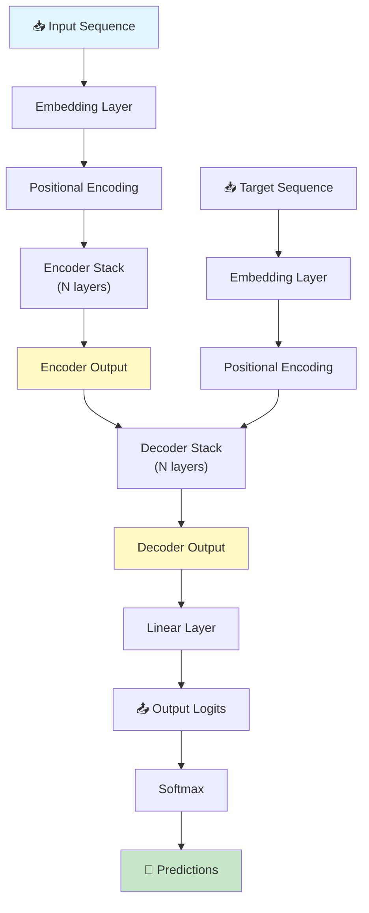
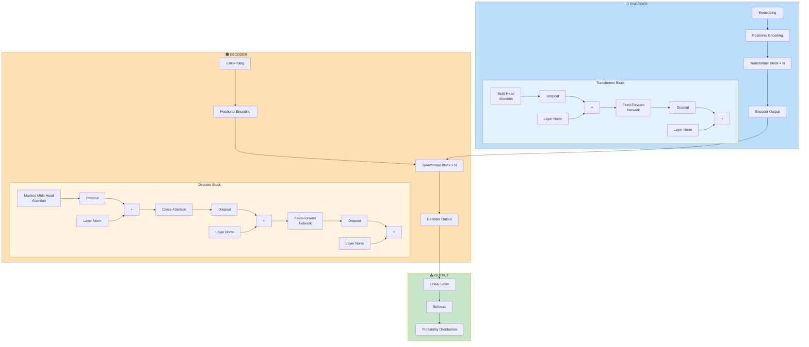
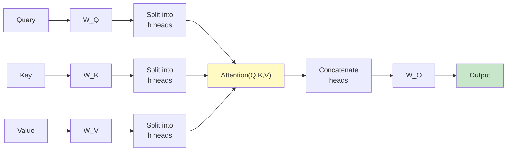

# 🔄 Transformer Model from Scratch using TensorFlow

> A complete implementation of the Transformer architecture from first principles using TensorFlow/Keras

[](LICENSE)
[](https://tensorflow.org)
[](https://python.org)

---

## 📑 Quick Navigation

<details open>
<summary><b>🎯 Table of Contents</b></summary>

- [Overview](#-overview)
- [Architecture Flow](#-architecture-flow)
- [Core Components](#-core-components)
- [Detailed Architecture](#-detailed-architecture)
- [Implementation Guide](#-implementation-guide)
- [Usage Example](#-usage-example)
- [Key Concepts](#-key-concepts)
- [Project Structure](#-project-structure)

</details>

---

## 🎯 Overview

The **Transformer** is a deep learning architecture designed for sequence-to-sequence tasks such as:
- Machine Translation
- Text Summarization
- Question Answering
- Language Modeling

Unlike RNNs/LSTMs, Transformers use **self-attention mechanisms** to capture long-range dependencies efficiently and enable parallel processing.

### Key Advantages
✅ Parallel processing of sequences  
✅ Captures long-range dependencies  
✅ Highly parallelizable training  
✅ State-of-the-art results on NLP tasks  

---

## 🔀 Architecture Flow



---

## 🧩 Core Components

<details open>
<summary><b>Core Building Blocks</b></summary>

### 1. **Positional Encoding** 
Encodes token positions using sine/cosine functions.
```
Position (pos, 2i):     sin(pos / 10000^(2i/d_model))
Position (pos, 2i+1):   cos(pos / 10000^(2i/d_model))
```

### 2. **Multi-Head Attention**
Applies attention mechanism with multiple representation subspaces.

### 3. **Feed-Forward Network**
Position-wise dense layers: Dense → ReLU → Dense

### 4. **Layer Normalization & Residual Connections**
Stabilizes training with: `Output = LayerNorm(Input + Sublayer(Input))`

</details>

---

## 📊 Detailed Architecture

### Complete Transformer Block Diagram



---

## 🔍 Multi-Head Attention Mechanism



---

## 💻 Implementation Guide

<details>
<summary><b>Step-by-Step Implementation</b></summary>

### Step 1: Positional Encoding
```python
def positional_encoding(position, d_model):
    angle_rads = np.arange(position)[:, np.newaxis] / np.power(
        10000, (2 * (np.arange(d_model) // 2)) / np.float32(d_model))
    angle_rads[:, 0::2] = np.sin(angle_rads[:, 0::2])
    angle_rads[:, 1::2] = np.cos(angle_rads[:, 1::2])
    return tf.cast(angle_rads[np.newaxis, ...], dtype=tf.float32)
```

### Step 2: Multi-Head Attention Class
```python
class MultiHeadAttention(tf.keras.layers.Layer):
    def __init__(self, d_model, num_heads):
        super(MultiHeadAttention, self).__init__()
        self.num_heads = num_heads
        self.d_model = d_model
        self.depth = d_model // num_heads
        # Linear transformations for Q, K, V
        # Scaled dot-product attention
        # Output projection
```

### Step 3: Transformer Block
```python
class TransformerBlock(tf.keras.layers.Layer):
    def __init__(self, d_model, num_heads, dff, dropout_rate=0.1):
        self.att = MultiHeadAttention(d_model, num_heads)
        self.ffn = PositionwiseFeedforward(d_model, dff)
        # Layer normalizations and dropouts
```

### Step 4: Encoder & Decoder
```python
class Encoder(tf.keras.layers.Layer):
    # Stack of transformer blocks
    # Embedding + Positional Encoding
    
class Decoder(tf.keras.layers.Layer):
    # Stack of transformer blocks with cross-attention
    # Embedding + Positional Encoding
```

### Step 5: Full Transformer Model
```python
class Transformer(tf.keras.Model):
    def __init__(self, num_layers, d_model, num_heads, dff, ...):
        self.encoder = Encoder(...)
        self.decoder = Decoder(...)
        self.final_layer = Dense(target_vocab_size)
```

</details>

---

## 🚀 Usage Example

```python
# Initialize model parameters
num_layers = 4
d_model = 128
num_heads = 8
dff = 512
input_vocab_size = 8500
target_vocab_size = 8000
maximum_position_encoding = 10000

# Create transformer model
transformer = Transformer(
    num_layers, d_model, num_heads, dff,
    input_vocab_size, target_vocab_size,
    maximum_position_encoding
)

# Prepare input data
inputs = tf.random.uniform((64, 50), dtype=tf.int64, minval=0, maxval=input_vocab_size)
targets = tf.random.uniform((64, 50), dtype=tf.int64, minval=0, maxval=target_vocab_size)

# Forward pass
output = transformer((inputs, targets), training=True)
print(f"Output shape: {output.shape}")  # (64, 50, 8000)
```

**Output Interpretation:**
- **64**: Batch size (64 sentences)
- **50**: Sequence length (50 tokens per sentence)
- **8000**: Target vocabulary size (probability distribution over 8000 tokens)

---

## 🧠 Key Concepts

<details>
<summary><b>Important Concepts Explained</b></summary>

### Attention Mechanism
Attention = Softmax(Q·K^T / √d_k) · V

Where:
- **Q (Query)**: What are we looking for?
- **K (Key)**: What can we find?
- **V (Value)**: What do we return?

### Self-Attention vs Cross-Attention
- **Self-Attention**: Q, K, V come from the same input
- **Cross-Attention**: Q from decoder, K, V from encoder output

### Masking
- **Padding Mask**: Prevents attention to padding tokens
- **Look-Ahead Mask**: Prevents decoder from seeing future tokens (autoregressive)

### Scaling Factor
√d_k prevents softmax from having extreme gradients when d_k is large

### Residual Connections
Enable training deeper networks by creating shortcuts: `Output = Input + f(Input)`

### Layer Normalization
Normalizes across feature dimension: `LayerNorm(x) = γ · (x - μ) / σ + β`

</details>

---

## 📁 Project Structure

```
Transformer-Model-from-Scratch/
├── README.md                 # This file
├── Transformer.ipynb        # Complete implementation notebook
│   ├── Imports
│   ├── Positional Encoding
│   ├── Multi-Head Attention
│   ├── Feed-Forward Network
│   ├── Transformer Block
│   ├── Encoder
│   ├── Decoder
│   ├── Full Transformer Model
│   └── Training & Testing
└── requirements.txt         # Dependencies
```

---

## 📊 Model Parameters Reference

| Parameter | Value | Description |
|-----------|-------|-------------|
| `num_layers` | 4 | Number of encoder/decoder layers |
| `d_model` | 128 | Embedding dimension |
| `num_heads` | 8 | Number of attention heads |
| `dff` | 512 | Feed-forward hidden dimension |
| `input_vocab_size` | 8500 | Input vocabulary size |
| `target_vocab_size` | 8000 | Target vocabulary size |
| `dropout_rate` | 0.1 | Dropout probability |
| `max_position_encoding` | 10000 | Maximum sequence length |

---

## 🎓 Learning Resources

- [Attention is All You Need](https://arxiv.org/abs/1706.03762) - Original Paper
- [The Illustrated Transformer](http://jalammar.github.io/illustrated-transformer/) - Visual Guide
- [TensorFlow Documentation](https://www.tensorflow.org/guide/keras)

---

## 📝 Notes

- The model uses **positional encoding** instead of RNN recurrence to capture sequence position
- **Multi-head attention** allows the model to focus on different representation subspaces
- **Residual connections** and **layer normalization** stabilize training
- The decoder uses **causal/look-ahead masking** to prevent attending to future tokens

---

## 📄 License

This project is licensed under the MIT License.

---

**Last Updated**: April 2026 | **Status**: ✅ Complete & Functional
